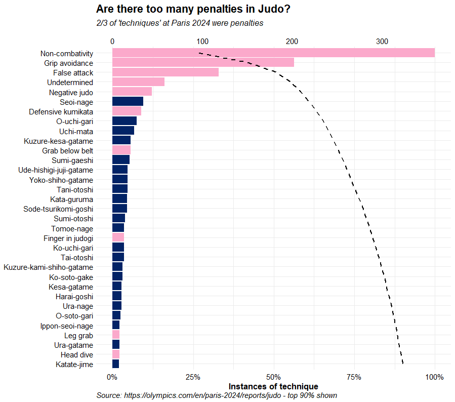
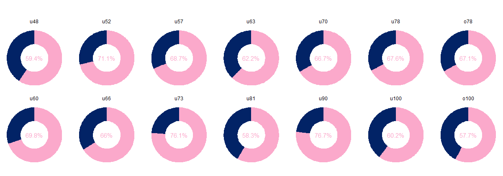
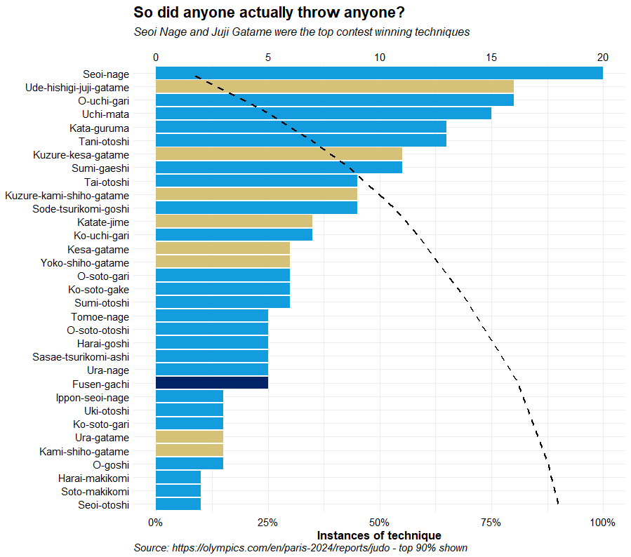
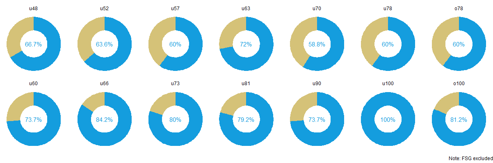

# Paris 2024 Judo

*Analysis of the top techniques and contest winning techniques at Paris 2024 based on official results published at: <https://olympics.com/en/paris-2024/reports/judo>. Extracted 07 August 2024.*

## Were there as many penalties as it felt like?

Approximately 2/3 of all 'techniques' recorded during the event were penalties, and penalties comprised 6 of the top 10 techniques. The top 5 were:

1.  Non-combativity (27%)
2.  Grip avoidance (15%)
3.  False attack (9%)
4.  Undetermined (4%)
5.  Negative Judo (3%)

Only the -48s, -81s and +100s managed to keep their shido rate below 60%. By contrast, more than 3 out of every 4 'technique' was a penalty in the u73s and u90s.

# So did anyone actually win a contest with a score?

Seoi nage lead the way for contest-winning techniques, 8% of contests were won with a Seoi nage. Juji Gatame was the only Ne Waza representative in the top 5. Only 3 contests were won with O Goshi.

Most contests were won with a Tachi Waza score, just under 60% in the -70s, but 60% or higher in every other category. Every single contest in the -100s was won in Tachi Waza.

